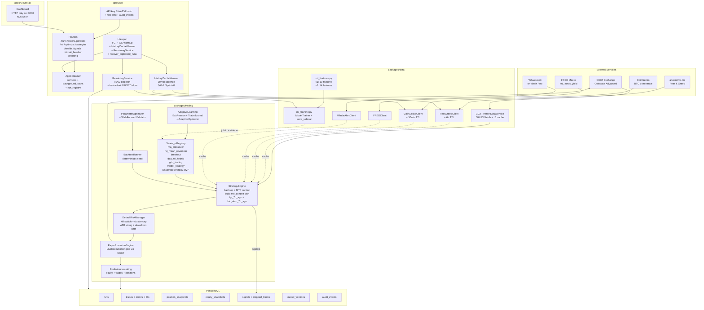

# Architecture — AI Crypto Trading Bot

**Sprint 48 D1 deliverable.** Snapshot as of 2026-05-21 (Sprint 47 + S47-5 shipped, post-Sprint-46 v2 schema operational, model_strategy pipeline confirmed dead — see [`reports/sprint48-model-strategy-bug.md`](reports/sprint48-model-strategy-bug.md)).

This document is the authoritative architecture overview going into the AppAnalyse 7-phase production-hardening roadmap.

---

## 1. System diagram



---

## 2. Project layout

```
/apps
  /api         FastAPI backend (Python 3.11+, async)
    /routers   17 routers — runs, ml, optimize, strategies, portfolio, ...
    /services  HistoryCacheWarmer (S47-1), RetrainingService, audit_log,
               run_orchestrator, run_persistence
    container.py  AppContainer + ServiceRegistry + BackgroundTaskRegistry
    main.py    Lifespan, router wiring, settings, structlog
  /ui          Next.js 14 dashboard (TypeScript + Tailwind)

/packages
  /trading     StrategyEngine, BaseStrategy, 7 strategies incl. EnsembleStrategy,
               DefaultRiskManager, PaperExecutionEngine, LiveExecutionEngine,
               BacktestRunner, ParameterOptimizer, WalkForwardValidator,
               AdaptiveOptimizer, TradeJournal, FearGreedClient consumer
  /data        ml_features.py v1+v2, ml_training.py ModelTrainer + save_sidecar,
               CCXTMarketDataService, FearGreedClient, CoinGeckoClient,
               FREDClient, WhaleAlertClient
  /common      Pydantic types (OrderSide, SignalDirection, TimeFrame, OHLCVBar,
               MultiTimeframeContext with v2 fields)

/infra         Docker Compose, Alembic migrations (010 in production)
/docs          KickOff.md, architecture docs, user guide
/scripts       train_model.py, diagnose_error_runs.py (Sprint 48 D2)
/tests
  /unit        1710+ tests, 0 mypy errors, structlog-aware
  /integration Run-creation flow, retraining, ensemble (S47-2 planned)

/reports       Sprint reports including Sprint 48 D1-D5
```

---

## 3. Per-layer concerns + AppAnalyse cross-reference

### Layer 1 — Data ingest

**Files:** `packages/data/services/ccxt_market_data.py`, `packages/data/sentiment.py`, `packages/data/market_signals.py`, `packages/data/macro_data.py`, `packages/data/whale_tracker.py`

**Current state:**
- CCXT integration: working, Coinbase Advanced via spot-only. Page limit 300 (Coinbase max).
- FGI: latest + 30-day history cached (S47-1). 6-hour TTL.
- CoinGecko BTC dominance: latest cached + history attempted PRO endpoint → free-tier 401 → graceful empty Series. Manual CSV override hook (`set_btc_dominance_history`).
- FRED: optional via FRED_API_KEY.
- Whale Alert: optional via WHALE_ALERT_API_KEY.

**Gaps tied to AppAnalyse:**
- Item 18 — orderbook L2 + funding rates NOT in feature pipeline.
- Item 18 — whale_net_flow + macro signals are *cached on MTF context* but NO strategy currently consumes them.
- Item 11 — no feature store (data is recomputed every bar; no Parquet/DuckDB persistence; no PSI/KS drift monitoring).

### Layer 2 — Feature pipeline

**Files:** `packages/data/ml_features.py`

**Current state:**
- v1 schema (10 features): bars-path + DataFrame-path, byte-identical.
- v2 schema (14 features): adds htf_trend, fgi_level_norm, fgi_delta_7d, btc_dom_delta_7d.
- v2 sync accessors: `value_at_offset_from_cache` (S47-1 unblocked) + `btc_dominance_at_offset_from_cache` (S47-1 unblocked; free-tier degraded for BTC dom).
- StrategyEngine populates 7d_ago fields via cache lookups — verified post-S47-1 deploy with `last_fgi_points: 30` in production.

**Gaps:**
- Item 10 — `future_return` labelling has potential leakage (looks forward N bars from current bar; if exit aligns with future signal, label can be optimistic). Audit needed.
- Item 12 — no train/val/test embargo between split boundaries.
- Item 11 — features computed per bar; not stored / versioned. No drift detection.

### Layer 3 — Strategy

**Files:** `packages/trading/strategies/*.py`, `packages/trading/strategy.py`, `packages/trading/strategy_engine.py`

**Current state:**
- 7 strategies registered: ma_crossover, rsi_mean_reversion, breakout, dca_rsi_hybrid, grid_trading, model_strategy, EnsembleStrategy MVP (Sprint 46 QT-008 — not yet API-wired, see S47-2).
- StrategyEngine bar loop is multi-symbol-aware, supports HTF context, trailing stops, position sizing, risk checks.
- BaseStrategy contract: `on_start(run_id)`, `on_bar(bars, mtf_context)`, `on_stop()`, `min_bars_required`, `htf_timeframes`.

**Gaps:**
- Item 13 — no champion/challenger / shadow trading. Model activation is immediate hot-swap.
- Item 14 — `model_strategy` is DEAD in production (see [D3](reports/sprint48-model-strategy-bug.md)). 9 active model_version rows reference .joblib files that don't exist on disk. Run configs are missing `model_path`. Multi-layer failure.
- Strategy performance crisis: ma_crossover + breakout produce 94% of total loss (-$2,080 of -$2,212). See [D4](reports/sprint48-strategy-performance.md).

### Layer 4 — Risk

**Files:** `packages/trading/risk.py`, `packages/trading/risk_manager.py`, `packages/trading/safety.py`

**Current state:**
- DefaultRiskManager: kill switch (Sprint 6 + 32), max_position_size_pct, max_portfolio_exposure_pct, max_cluster_exposure_pct (Sprint 46 QT-003), per_trade_risk_pct, max_daily_loss_pct, max_drawdown_pct, ATR-scaled sizing (Sprint 42 QT-002), cooldown after loss streak.
- 3-layer live trading gate (Sprint 41 SEC-004): env flag + API keys + X-Live-Confirm-Token header (header-authoritative, body deprecated).
- Graduated CircuitBreaker (Sprint 32): OK / REDUCE / DAILY_LIMIT / HALT.
- Per-run risk limits enforced via DefaultRiskManager.pre_trade_check on every order.

**Gaps:**
- Item 4 — **no global kill switch.** SEC-006 emergency-stop is per-run only. A "stop everything" endpoint + UI button does not exist.
- Item 5 — auto-stop on per-run risk breach: limits exist but enforcement is "reject the order", not "stop the run". A breach of max_drawdown_pct rejects orders but the run keeps polling.
- Item 6 — paper→live promotion gate does not exist. An operator can create a live run from any paper run config without statistical validation.
- Item 15 — vol-targeting position sizing missing. Sizing is currently fixed % or ATR-based per trade; not annualised-vol-target.
- Item 16 — correlation-aware allocator missing. Sprint 46 QT-003 caps cluster exposure but doesn't dynamically allocate.

### Layer 5 — Execution

**Files:** `packages/trading/execution.py`, `packages/trading/engines/paper.py`, `packages/trading/engines/live.py`

**Current state:**
- PaperExecutionEngine: simulated fills, fee model (Coinbase 0.60/0.40%), slippage with Almgren market-impact (Sprint 42 QT-001), expected_price + slippage_bps_realized telemetry (Sprint 42 QT-009).
- LiveExecutionEngine: CCXT MARKET/LIMIT, idempotency via client_order_id, exchange_order_id persistence (Sprint 18), reconciliation map.
- Order state machine: NEW → PARTIAL → FILLED/CANCELED/REJECTED.

**Gaps:**
- Item 7 — funding cost model: spot-only MVP, not needed yet. If perp futures added, must implement.
- Slippage model is Almgren sqrt-impact; lacks ADV-fraction calibration.

### Layer 6 — Ops / Observability

**Files:** `apps/api/main.py` (lifespan), `apps/api/services/*`, `packages/common/metrics.py`

**Current state:**
- Structured JSON logging via structlog with TO-008 request_id correlation (Sprint 44).
- Prometheus `/metrics` endpoint with run_id labels on counters/gauges/histograms.
- Audit log (Sprint 41 SEC-002): live_trading_enabled, model_activated, circuit_breaker_reset, emergency_stop event types with CHECK constraint.
- Background tasks: equity_prune (1×/day), RetrainingService (1h cadence), HistoryCacheWarmer (30min S47-1), AdaptiveLearningTask (per-run optional).
- `/api/v1/health/background` endpoint (S47-6): surfaces all background-task state.

**Gaps:**
- Item 20 — no Grafana dashboard template.
- Item 21 — Telegram notifier exists; daily reporting exists (Sprint 35); but no drawdown-breach / stale-data / exchange-disconnect / model-drift alerts.
- Item 22 — 14 error runs in DB. No auto-retry. See [D2](reports/sprint48-error-run-diagnosis.md).

### Layer 7 — UI / UX

**Files:** `apps/ui/**`

**Current state:**
- Next.js 14 dashboard at HTTP `:3000` — public, no auth.
- Home page: aggregate portfolio + summary cards.
- Runs page: server-side pagination + filter pills (Sprint 17).
- Run detail: trades, orders, fills, positions tabs with sortable columns (Sprint 14 + 17 + 18).
- Backtest metrics cards (Sprint 13 + 14).
- Model Management page (Sprint 23).
- Optimizer page (Sprint 30).

**Gaps:**
- Item 3 — **no auth, no HTTPS** — see [D5](reports/sprint48-security-exposure.md).
- Item 23 — run-detail routing currently requires full UUID; short-ID lookup not implemented.
- Item 24 — per-symbol PnL attribution, fee/slippage breakdown, CSV export per symbol — all missing.
- Item 25 — tags, notes, favorites on runs — missing.
- Item 26 — currency consistency (EUR vs USD detection + daily FX rate conversion) — missing.
- Item 27 — mobile-responsive sidebar (collapse <768px) — missing.

---

## 4. AppAnalyse phase → existing capability cross-reference

| Item | Description | Status |
|------|-------------|--------|
| 1 | Repo structure map | **D1 (this doc)** |
| 2 | ARCHITECTURE.md | **D1 (this doc)** |
| 3 | Auth + HTTPS | NOT DONE — [D5](reports/sprint48-security-exposure.md); Sprint 49 |
| 4 | Global kill switch | NOT DONE; Sprint 49 |
| 5 | Per-run auto-stop | PARTIAL (rejects orders; doesn't stop run); Sprint 49 |
| 6 | Promotion gate | NOT DONE; Sprint 49 |
| 7 | Cost model | Partial (fees + slippage); funding for perps deferred (spot-only) |
| 8 | Walk-forward + purged k-fold | Partial (WalkForwardValidator); purged k-fold + embargo NOT DONE; Sprint 50 |
| 9 | DSR + PSR + bootstrap CIs | Partial (DSR done Sprint 41); PSR + bootstrap CIs NOT DONE; Sprint 50 |
| 10 | future_return leakage audit + triple-barrier | NOT DONE; Sprint 50 |
| 11 | Feature store + drift | NOT DONE; Sprint 51 |
| 12 | Train/val/test embargo + AUC/PR-AUC/Brier | NOT DONE; Sprint 51 |
| 13 | Champion/challenger + shadow trading | NOT DONE; Sprint 51 |
| 14 | Fix model_strategy | **CRITICAL** — see [D3](reports/sprint48-model-strategy-bug.md); Sprint 51 |
| 15 | Vol-targeting sizing | NOT DONE; Sprint 52 |
| 16 | Correlation allocator | NOT DONE; Sprint 52 |
| 17 | Regime meta-allocator | Partial (AdaptiveOptimizer + FGI boost); regime-aware meta NOT DONE; Sprint 52 |
| 18 | Orderbook + funding + on-chain features in pipeline | NOT DONE; Sprint 52 |
| 19 | Structured logging + Prometheus | DONE (Sprint 44 TO-008) |
| 20 | Grafana | NOT DONE; Sprint 53 |
| 21 | Alerting | Partial (Telegram daily report); breach/drift alerts NOT DONE; Sprint 53 |
| 22 | Auto-retry error runs | NOT DONE — see [D2](reports/sprint48-error-run-diagnosis.md); Sprint 53 |
| 23 | Short-ID routing | NOT DONE; Sprint 54 |
| 24 | Per-symbol PnL + fee breakdown + CSV | NOT DONE; Sprint 54 |
| 25 | Tags / notes / favorites | NOT DONE; Sprint 54 |
| 26 | Currency consistency | NOT DONE; Sprint 54 |
| 27 | Mobile sidebar | NOT DONE; Sprint 54 |

---

## 5. Acceptance for Sprint 48 FASE 0

This document (D1) + the four reports under `reports/sprint48-*.md` together fulfil the FASE 0 deliverable. They contain:

1. ARCHITECTURE.md with mermaid diagram + per-layer concerns ✓ (this document).
2. Error-run root-cause diagnosis ✓ ([D2](reports/sprint48-error-run-diagnosis.md)).
3. `model_strategy` 0-trades root cause + remediation plan ✓ ([D3](reports/sprint48-model-strategy-bug.md)).
4. Strategy performance attribution ✓ ([D4](reports/sprint48-strategy-performance.md)).
5. Security exposure inventory ✓ ([D5](reports/sprint48-security-exposure.md)).

The user reviews and approves before Sprint 49 (FASE 1) begins.

---

## 6. Open questions surfaced by the audit

These need user input before Sprint 49 scope is finalised:

1. **DNS / domain** for Caddy + Let's Encrypt — D5 R-1.
2. **NextAuth provider** (credentials, GitHub OAuth) — D5 R-2.
3. **Operator decision on ma_crossover + breakout** (keep / demote to backtest-only / disable until regime filters ship) — D4 #1.
4. **Historical loss exclusion** (430 ma_crossover BTC/USD trades may pre-date Coinbase migration) — D4 #2.
5. **model_strategy clean-up SQL** (deactivate 9 stale model_version rows before Sprint 49 ships file-integrity check) — D3 cleanup section.
